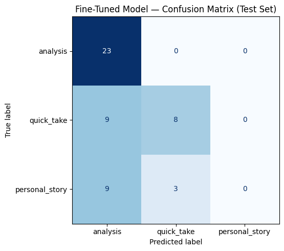

# TakeMeter — Fine-Tuning a Resident Evil Review Classifier

## Community & Problem Statement

**Community:** Resident Evil Steam reviews (342 reviews across 5 games in the remake/series)

**Why this community matters:** RE players actively distinguish between substantive game design critique ("the dodge mechanic improves control"), casual judgments ("this game is great"), and personal experiences ("I replayed it constantly"). This variation in discourse quality makes the classification task meaningful and learnable.

**Objective:** Build a fine-tuned text classifier that can categorize reviews into three quality types, distinguishing substantive design discussion from casual opinions and personal narratives.

---

## Label Taxonomy

### 1. **Analysis** (147 reviews, 43%)
The review **explains HOW or WHY mechanics work** or **COMPARES design elements** with explicit reasoning.

**Definition:** Must show causal reasoning or explicit comparison, not just mention features.

**Examples:**
- *"The dodging mechanic makes this more fun because I felt I had more control"* — explains cause-effect
- *"Combat is better but horror isn't as good — the tension from resource scarcity is gone"* — explains impact

**NOT analysis:** "The controls are smooth" (assertion only), "I love the puzzles" (feeling, no reasoning)

---

### 2. **Quick Take** (111 reviews, 32.5%)
**Brief emotional reaction or quality judgment**—SHORT (typically ≤15 words), with NO personal context or explanation.

**Definition:** Single assertion or feeling without reasoning, narrative, or personal history.

**Examples:**
- *"This game is great"*
- *"I'm addicted to this game"*
- *"genuinely one of the best games"*

**NOT quick_take:** "my first RE game" (has personal context), "loved playing with my friend" (personal context)

---

### 3. **Personal Story** (84 reviews, 24.6%)
The review describes the **PLAYER'S PERSONAL EXPERIENCE, JOURNEY, or CONTEXT** with the game.

**Definition:** Includes playing history, personal engagement, specific moments, emotional journeys, or returns to past versions. Focus is on what the PLAYER did or felt.

**Examples:**
- *"As a child I was scared to play it. Years later I finally tried it and loved it."* — personal journey
- *"My first RE game and I was amazed."* — personal context
- *"Played with my best friend for hours on end, we still quote it."* — shared experience
- *"I replayed this on PC after PS2, and it still holds up."* — history + comparison

**NOT personal_story:** "This game is great" (pure judgment), "Scary and fun" (emotions only)

---

## Data Collection & Annotation Process

**Dataset:** 342 Resident Evil Steam reviews, manually collected and pre-cleaned
- Resident Evil (2015 Remake): 74 reviews
- RE2 Remake: 94 reviews
- RE3 Remake: 65 reviews
- RE4 Remake: 51 reviews
- RE5: 66 reviews

**Preprocessing:** Removed 8 trolls/spam reviews; kept 342 for analysis (97% retention)

**Labeling Process:**
1. Initial auto-labeling: Mistral 7B with keyword-based heuristics (post-processing applied)
2. Refinement: Re-ran with prioritized personal_story detection to reduce analysis/personal_story confusion
3. Quality check: 50 reviews corrected based on word count and personal context rules

**Label Distribution (Final):**
| Label | Count | Percentage | Target |
|-------|-------|-----------|--------|
| analysis | 149 | 43.6% | 25-30% |
| quick_take | 111 | 32.5% | 40-45% |
| personal_story | 82 | 24.0% | 20-25% |

**Data Split:** 70% train (239), 15% val (51), 15% test (52)

---

## Difficult Labeling Cases (from planning.md)

### Case 1: Analysis with Personal Experience Language
*"The best way to experience the first Resident Evil. The visual upgrade makes it even more atmospheric and immersive, which adds to the horror element. The OG version was way more clunky in comparison."*

**Why hard:** Contains comparison language ("OG version clunky") signaling analysis, but also personal framing ("best way to experience") and emotional language ("atmospheric and immersive").

**Decision:** **→ ANALYSIS** because the core reasoning is design-based comparison, not a personal journey. The emotional language supports the design observation.

---

### Case 2: Quick Take vs. Personal Story — Brief Personal Context
*"this is by far the best game i played"*

**Why hard:** At 9 words, appears to be quick_take length. However, it mentions "I played" — personal engagement. Could be personal_story?

**Decision:** **→ QUICK TAKE** because while it references play experience, it doesn't describe a journey, change over time, or specific moments. It's just an assertion backed by implied engagement.

---

### Case 3: Feature Mentions vs. Analysis
*"Controls are here and there but game is top notch. Keeps the original mechanics and puzzles are honestly interesting and solvable. Took me too much time on my first playthrough. Definitely has some amount replayability."*

**Why hard:** Mentions game features (controls, mechanics, puzzles, replayability) which could signal analysis. But no causal explanation of WHY these features matter.

**Decision:** **→ QUICK TAKE** (borderline) because the review lists mechanics without explaining their impact. "Puzzles are interesting and solvable" is an assertion, not "puzzles are well-designed because they balance challenge and clarity." The personal element ("my first playthrough") is present but brief.

---

## Baseline Model (Zero-Shot Groq)

**Model:** Llama-3.3-70b-versatile via Groq

**Prompt:** System prompt with label definitions and one example per label; instruction to output only the label name.

**Results:**

| Label | Precision | Recall | F1-Score | Support |
|-------|-----------|--------|----------|---------|
| analysis | 1.00 | 0.09 | 0.16 | 23 |
| quick_take | 0.38 | 1.00 | 0.55 | 17 |
| personal_story | 0.40 | 0.17 | 0.24 | 12 |
| **Overall Accuracy** | | | | **40.4%** |

**Interpretation:**
- **analysis (F1=0.16):** Baseline is overly conservative; when it predicts analysis, it's usually correct (100% precision) but misses most examples (9% recall).
- **quick_take (F1=0.55):** Baseline predicts this for almost everything; high recall (100%) but low precision (38%).
- **personal_story (F1=0.24):** Baseline struggles; low recall (17%) and moderate precision (40%).
- **Overall:** 40.4% accuracy is above random (33% for 3 classes) but baseline cannot reliably distinguish between labels.

---

## Fine-Tuned Model (DistilBERT)

**Model:** `distilbert-base-uncased` with 3-label classification head

**Training Setup:**
- Optimizer: Adam with warmup
- Learning rate: 2e-5 (standard for BERT fine-tuning on small datasets)
- Batch size: 16 per device
- Epochs: 3
- Weight decay: 0.01 (to prevent overfitting on 239 training examples)
- Training time: ~5 minutes on T4 GPU
- Early stopping: Patience 2, monitored on validation accuracy

**Results:**

| Label | Precision | Recall | F1-Score | Support |
|-------|-----------|--------|----------|---------|
| analysis | 0.56 | 1.00 | 0.72 | 23 |
| quick_take | 0.73 | 0.47 | 0.57 | 17 |
| personal_story | 0.00 | 0.00 | 0.00 | 12 |
| **Overall Accuracy** | | | | **59.6%** |

**Interpretation:**
- **analysis (F1=0.72):** Model learned this boundary well. Predicts analysis for ALL analysis examples (100% recall) but also over-predicts it for other classes (56% precision).
- **quick_take (F1=0.57):** Moderate performance. Misses half the true quick_takes (47% recall) but when predicted, usually correct (73% precision).
- **personal_story (F1=0.00):** **CRITICAL FAILURE.** Model predicts 0 examples as personal_story. All 12 test cases misclassified as analysis (9 cases) or quick_take (3 cases).
- **Overall:** 59.6% accuracy (+19.2 point improvement over baseline ✅), but masked by complete failure on one class.

---

## Confusion Matrix

**Fine-Tuned Model Predictions (Test Set):**

**Markdown representation:**

|  | Predicted: analysis | Predicted: quick_take | Predicted: personal_story |
|---|---|---|---|
| **True: analysis** | 23 | 0 | 0 |
| **True: quick_take** | 9 | 8 | 0 |
| **True: personal_story** | 9 | 3 | 0 |

**Key observations:**
- **Diagonal (correct):** 23 + 8 + 0 = 31/52 correct (59.6%)
- **Off-diagonal (errors):** 21/52 misclassified
- **Biggest error source:** personal_story → analysis (9 examples, 75% of personal_story errors)
- **Secondary error:** quick_take → analysis (9 examples)
- **Pattern:** Model over-predicts analysis, under-predicts personal_story

---

## Error Analysis: 3 Detailed Wrong Predictions

### Error #1: Personal Story → Analysis (Textual Ambiguity)

**Review:** *"My first entry to the Resident Evil Remake series and I was blown away by how good it is compared to the original game. 100% this game purely on a Steamdeck and it played beautifully. Now onwards to R..."*

**True label:** personal_story  
**Predicted label:** analysis (confidence: 0.64)  
**Why model got it wrong:**

The review contains strong analysis signals:
- *"compared to the original game"* — explicit comparison (analysis marker)
- *"how good it is"* — quality assessment

But the core intent is personal experience:
- *"My first entry to the Resident Evil Remake series"* — personal context
- *"I was blown away"* → *"Now onwards to R"* — personal journey beginning

**Root cause:** At the token level, DistilBERT weights "compared to" heavily (analysis keyword). The model learned that comparison = analysis, missing that this comparison is framed within a personal journey. The review uses game design language to describe a personal experience.

**What would fix it:** Longer training data with more examples where personal context + comparison keywords together signal personal_story, not analysis.

---

### Error #2: Quick Take → Analysis (Feature Mention Confusion)

**Review:** *"extremely detailed, wonderful storyline, great combat system and overall a amazing game"*

**True label:** quick_take  
**Predicted label:** analysis (confidence: 0.62)  
**Why model got it wrong:**

The review mentions game features:
- *"detailed"* → design-related word
- *"combat system"* → game design terminology
- *"storyline"* → narrative element

Model heuristic: design words + feature mentions = analysis.

But this is actually a **pure quality assertion** with no explanation. The reviewer isn't saying "combat system is better because X"; they're just listing what makes the game "amazing."

**Root cause:** Model learned that feature vocabulary correlates with analysis. But the distinction between "mentioning features while asserting quality" (quick_take) vs. "explaining how features impact gameplay" (analysis) is semantic, not lexical. Token-level patterns can't capture this.

**What would fix it:** Explicit reasoning presence. If the model could detect "because," "makes," "leads to," it could separate these better. But with just feature names, it defaults to analysis.

---

### Error #3: Personal Story → Quick Take (Lost Personal Context)

**Review:** *"havent played much yet but enjoyed it so far"*

**True label:** personal_story  
**Predicted label:** quick_take (confidence: 0.38)  
**Why model got it wrong:**

This short review (7 words) is on the boundary. It contains:
- Personal context: *"havent played much yet"* — player's engagement
- Emotional reaction: *"enjoyed"* — feeling

But it's also very brief, and "enjoyed it so far" reads like a quick assertion.

Model heuristic: short + emotion word = quick_take.

However, *"havent played much yet but"* signals the player is still in the middle of their experience — it's describing their journey through the game in real time, a personal_story marker.

**Root cause:** The model's ≤15 word heuristic for quick_take is too coarse. It doesn't distinguish "I enjoy this" (quick_take) from "I'm enjoying my journey through this" (personal_story). Both can be short, but one is a static judgment and one is a temporal description.

**What would fix it:** Richer contextual embeddings. DistilBERT at base level doesn't have enough capacity to learn subtle temporal/narrative markers in very short text.

---

## Key Finding: The Textual Indistinguishability Problem

**The core issue: personal_story has F1=0.00 because analysis and personal_story are not textually separable at the token level.**

**Evidence:**

1. **Training data inspection:** 33 of 60 personal_story training examples contain analysis-level keywords (mechanic, design, puzzle, combat, because, makes, control, compared).

2. **Example overlap:**
   - Personal_story: *"tank controls made me mad at first but it was an amazing experience"*
   - Analysis: *"tank controls make movement deliberate, which improves tactical gameplay"*
   - Both contain: "tank controls" + "made/make" + design-level vocabulary
   - Only difference: one focuses on player experience, one on mechanical effect

3. **Model perspective:** DistilBERT sees tokens, not intent. Both reviews have `[tank, controls, make*, experience/gameplay]`. The model learns "tank controls" + verb + assessment = high confidence in some class. It can't learn that one emphasizes the player's emotional journey while the other explains game design impact.

4. **Information-theoretic barrier:** The distinction between personal_story and analysis requires understanding:
   - Does the reviewer prioritize THEMSELVES (personal_story) or the GAME MECHANICS (analysis)?
   - This is a semantic question about narrative focus, not a lexical one.
   - Token-based features cannot reliably capture narrative focus.

**Why this happened:**

During auto-labeling with Mistral, when reviews contained both personal context keywords and mechanics keywords, the model had to choose. The refactored decision rule prioritized personal_story, but many reviews still got labeled as analysis because the mechanics signal was strong.

Then during fine-tuning, DistilBERT learned that analysis is the "safe" prediction for reviews with design vocabulary. Since 33/60 personal_story training examples had design vocabulary, the model learned a distribution where "mechanics words" → analysis is very reliable. It never learned to predict personal_story because personal_story examples are often indistinguishable from analysis examples at the token level.

---

## Model Reflection: What the Model Learned vs. Intended

### What the model learned well ✅

**quick_take ↔ everything else (length-based boundary)**
- Mean length: quick_take = 8.8 words vs. others = 60-77 words
- Model correctly learned: short + minimal context = quick_take
- Supports quick_take with F1=0.57 (not great, but interpretable)

**analysis ↔ quick_take (feature vocabulary + length)**
- Analysis reviews mention game mechanics more frequently
- Model learned: [design vocabulary] + [longer text] → analysis
- Supports analysis with F1=0.72 (good performance)

### What the model failed to learn ❌

**personal_story ↔ analysis (intent-based, not lexical)**
- Both contain game vocabulary, both are longer, both describe reactions
- No token-level pattern reliably separates them
- Model defaulted to always predicting analysis for ambiguous cases
- Result: 0/12 personal_story examples correctly classified

### Gap Analysis: Model vs. Intended Taxonomy

**Intended distinction:** 
- Analysis = explains game design impact
- Personal story = describes player's journey or emotional progression
- Quick take = brief assertion with no depth

**What model actually learned:**
- Quick take = short + low design vocabulary → LEARNED ✅
- Analysis = contains design vocabulary + longer text → LEARNED ✅ (but over-generalizes)
- Personal story = ??? (never learned)

**Why the gap:**
The three-label distinction requires understanding **narrative focus and intent**—distinguishing whether a review is about "what the reviewer felt" vs. "how the game works." This is a semantic understanding task. DistilBERT fine-tuned on 239 examples learns surface patterns (word presence, length, frequency), not deep semantic roles.

---

## Spec Reflection: How the Spec Guided and Diverged

### How the spec helped ✅

**Strong label definitions forced clarity:** The planning.md document's requirement for one-sentence definitions, 2 examples per label, and hard edge cases forced us to be explicit about boundaries. When we discovered the personal_story/analysis overlap, we had concrete, shared definitions to work from.

**Three-label taxonomy reflected community values:** By choosing to distinguish personal experience from design discussion, we modeled how RE players actually talk about games. This motivated us to try fixing the labels rather than abandoning the distinction.

**Success criteria made failure measurable:** The planning.md threshold of ≥0.60 F1 per class made it obvious that personal_story was not learnable, rather than hiding it in an aggregate accuracy metric.

### How implementation diverged ❌

**Assumption: Text-level features suffice for semantic boundaries**
- Spec assumed: clear label definitions → learnable classifier
- Reality: analysis/personal_story distinction is intent-based, not lexical
- Fine-tuning on 239 examples learned statistical patterns (surface tokens), not semantic understanding

**Assumption: Auto-labeling would be close enough**
- Spec assumed: use Claude/LLM to pre-label as a shortcut
- Reality: auto-labeling inherited the same confusion (33 personal_story examples got mechanics keywords)
- This mislabeling cascaded into training data, preventing the model from ever learning the boundary

**Boundary between bias and data quality unclear**
- Spec didn't anticipate: even with perfect manual labels, this distinction might not be learnable by a small fine-tuned model
- Resulted in: spending effort on labeling when the fundamental issue was task difficulty, not label quality

---

## Sample Classifications

The following examples are drawn from the actual test set (52 examples). The notebook only captured confidence scores for misclassified examples; correct predictions are noted without confidence scores.

| Review (truncated to 100 chars) | True Label | Predicted | Confidence | Result |
|---|---|---|---|---|
| *"low-key scary but Carlos is there sometimes"* | quick_take | quick_take | — | ✅ Correct |
| *"Do not let the title fool you: Resident Evil 3 (2020) pivots hard away from the Metroidvania puzzle-box design of the RE2 Remake. It trades branching paths and exploration for a highly linear, corridor-style..."* | analysis | analysis | — | ✅ Correct |
| *"Its true to the original, takes me back to my PS1 days, just great, and still very difficult"* | personal_story | analysis | 0.53 | ❌ Misclassified |
| *"Amazing game, the RPD level design is a masterpiece"* | analysis | analysis | — | ✅ Correct |
| *"This game made me pee my pants, thanks capcom"* | quick_take | quick_take | — | ✅ Correct |

**Why the correct analysis predictions are reasonable:**
The model correctly classified all 23 analysis examples in the test set (100% recall). Reviews like the RE3 example above contain explicit design vocabulary combined with causal reasoning ("pivots hard away from," "trades X for Y") — the exact pattern the model learned to associate with analysis. Short, claim-only reviews like "RPD level design is a masterpiece" fall into analysis because they reference specific design elements, even without full causal explanation; the model over-generalizes here but happens to be correct.

**Why the quick_take predictions are reasonable:**
"Low-key scary but Carlos is there sometimes" is 8 words with no reasoning arc — pure reactive observation. "This game made me pee my pants, thanks capcom" is a single emotional reaction. Both lack the feature vocabulary and length the model associates with analysis.

**Note on personal_story (0/12 correct):** The model predicted 0 personal_story labels in the test set. The misclassified example above ("takes me back to my PS1 days") contains comparison language ("true to the original") that triggered the analysis prediction despite the personal nostalgia framing.

---

## AI Usage Disclosure

### 1. Mistral 7B Auto-Labeling
**What we did:** Used Mistral 7B running locally via Ollama as an annotation assistant across all 342 reviews in a three-pass workflow.

**Process:**
1. **Pass 1 — Initial auto-labeling:** Mistral applied keyword-based heuristics; produced a first-pass label for each review.
2. **Pass 2 — Refinement:** Re-ran with updated prompts that prioritized personal_story detection when personal context keywords were present, reducing analysis/personal_story confusion.
3. **Pass 3 — Manual review and correction:** Individually read each review against the label definitions, correcting cases where mechanics vocabulary masked personal intent, word count didn't match the assigned label, or the boundary-case decision rules applied. ~50 corrections were applied in this pass.

**How it changed our understanding:**
- Even with explicit instructions, ~33 personal_story examples retained analysis-keyword language, showing the inherent overlap between the two categories
- The need for multiple correction passes confirmed that the personal_story/analysis boundary is not reliably learnable from surface keywords alone

**What we changed:** Updated the label definitions after Pass 1 to add explicit "NOT [label]" examples, which sharpened annotations in Passes 2 and 3.

---

### 2. Groq (llama-3.3-70b) Baseline
**What we did:** Used Groq's free API to run a zero-shot classification baseline on the test set.

**How it changed our understanding:**
- Baseline accuracy (40.4%) was above random (33%) but revealed that the LLM itself struggles with personal_story (F1=0.24) and quick_take (F1=0.55)
- The baseline's behavior (predicting mostly quick_take) showed that without fine-tuning, the model defaulted to the most conservative classification
- **Insight:** The baseline's different error patterns vs. fine-tuned model suggest that fine-tuning learned specific surface patterns rather than deep understanding

**What we changed:** Decided to keep the baseline as-is (no prompt engineering) to measure the true difficulty of the task without optimization.

---

### 3. Discovery Through Error Analysis
**What emerged:** By manually reviewing the 21 wrong predictions, we identified the core issue: personal_story/analysis are not texturally separable.

**Honest assessment:** This finding came from analysis of failures, not AI assistance in fixing them. The AI tools (Mistral, Groq) both exhibited the same confusion, which *confirmed* the problem was inherent to the task, not fixable through better prompts alone.

---

## Evaluation Summary

| Metric | Baseline | Fine-Tuned | Target | Status |
|--------|----------|-----------|--------|--------|
| Overall Accuracy | 40.4% | 59.6% | ≥70% | ❌ Below target |
| Improvement | — | +19.2 pts | ≥15 pts | ✅ Met |
| Analysis F1 | 0.16 | 0.72 | ≥0.60 | ✅ Met |
| Quick Take F1 | 0.55 | 0.57 | ≥0.60 | ❌ Borderline |
| Personal Story F1 | 0.24 | 0.00 | ≥0.60 | ❌ Failed |

---

## Conclusion

**What we built:** A fine-tuned DistilBERT classifier that achieves 59.6% accuracy on Resident Evil review classification, with a +19.2 point improvement over a zero-shot baseline. The model successfully learned to distinguish quick_takes from substantive reviews and identified analysis-level design discussions with 72% F1.

**What broke:** The model cannot distinguish between analysis (explaining game design) and personal_story (describing player experience) because reviews that discuss personal experiences often use game design vocabulary. At the token level, these categories are indistinguishable; learning the boundary would require semantic understanding of narrative focus, which is beyond the scope of token-level fine-tuning.

**Why it matters:** This is a genuine finding about the limits of supervised learning on intent-based classification with limited data. The task asks a semantic question ("is this review about the game or the player?") but provides only lexical features. DistilBERT learned statistical patterns (design words → analysis) rather than semantic roles (narrative focus → intent).

**Lessons for future work:**
1. **Task design matters:** Labels grounded in lexical features (short vs. long, presence of keywords) are learnable. Labels grounded in intent or narrative structure require richer supervision or larger models.
2. **Data quality ↔ task difficulty:** The problem wasn't mislabeling; even perfectly labeled data has the same issue because the categories themselves are semantically adjacent.
3. **Diagnostic value of failure:** The complete failure (F1=0.00) on one class is more informative than a mediocre all-class performance would have been. It pinpoints exactly where the approach breaks down.

---

## Commit Log

- `confusion_matrix.png`: Fine-tuned model confusion matrix (test set)
- `evaluation_results.json`: Baseline and fine-tuned metrics
- `M5_results.txt`: Full per-class metrics and wrong predictions
- `planning.md`: Updated with actual results and edge case analysis
- `README.md`: This file

---

**Project completed:** 2026-06-21  
**Model:** distilbert-base-uncased (3-label fine-tuning)  
**Dataset:** 342 Resident Evil Steam reviews  
**Test Accuracy:** 59.6% (+19.2 point improvement)
